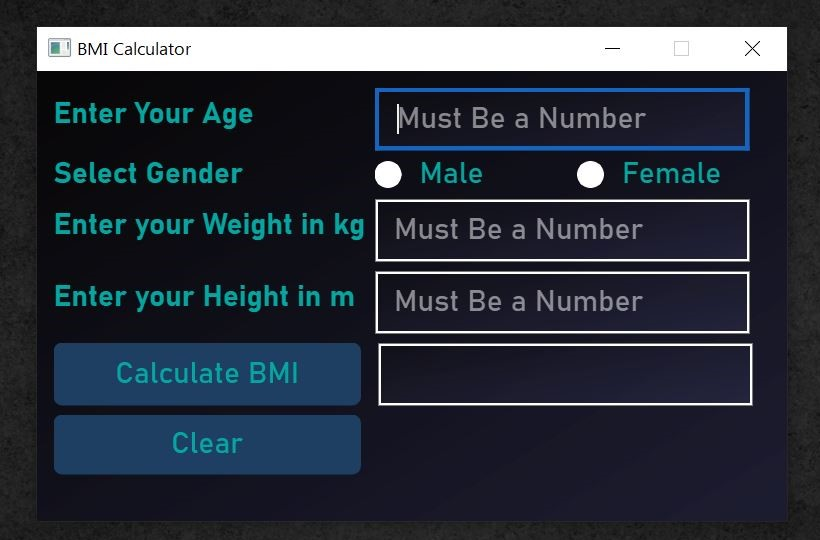
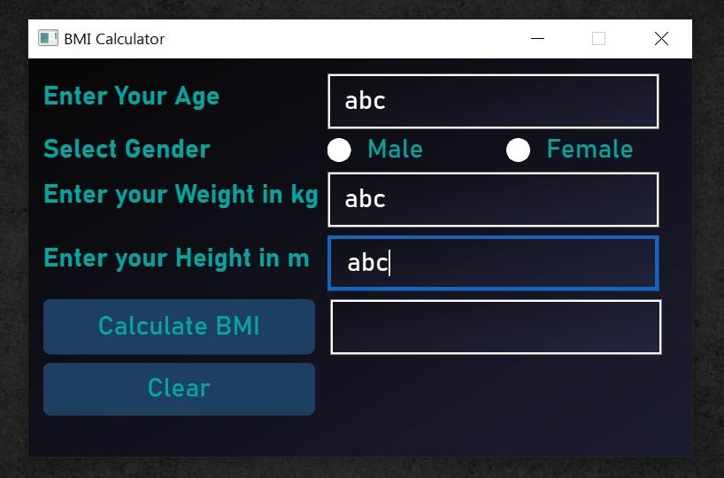
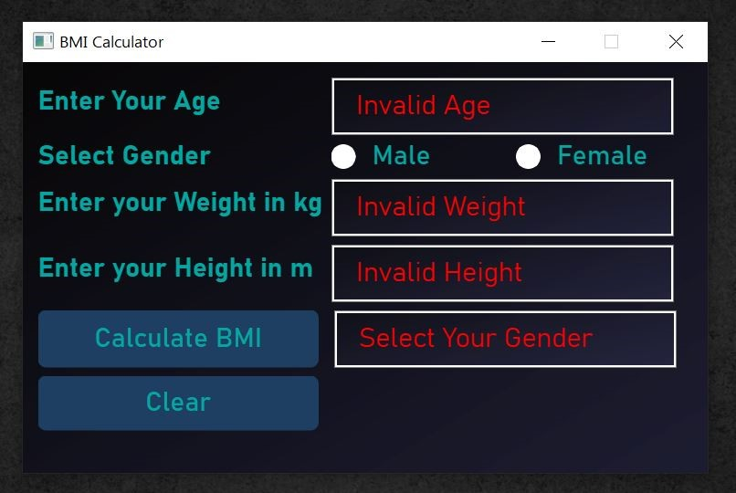
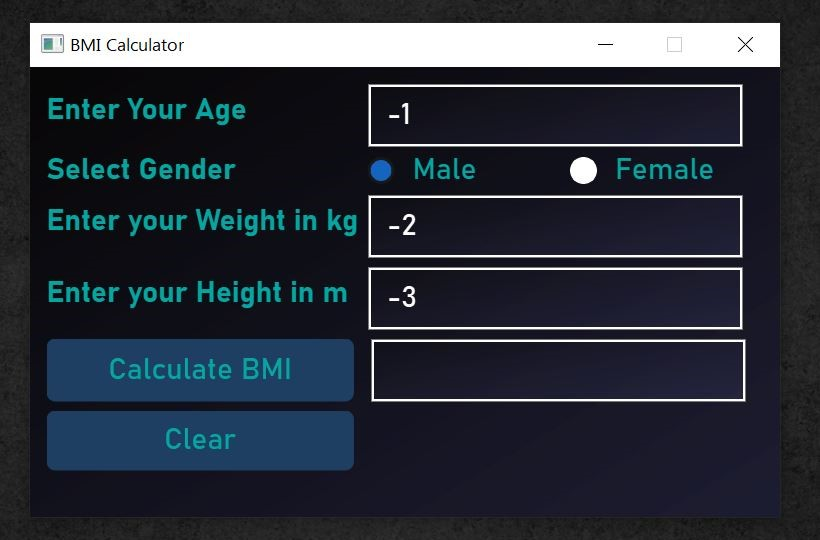
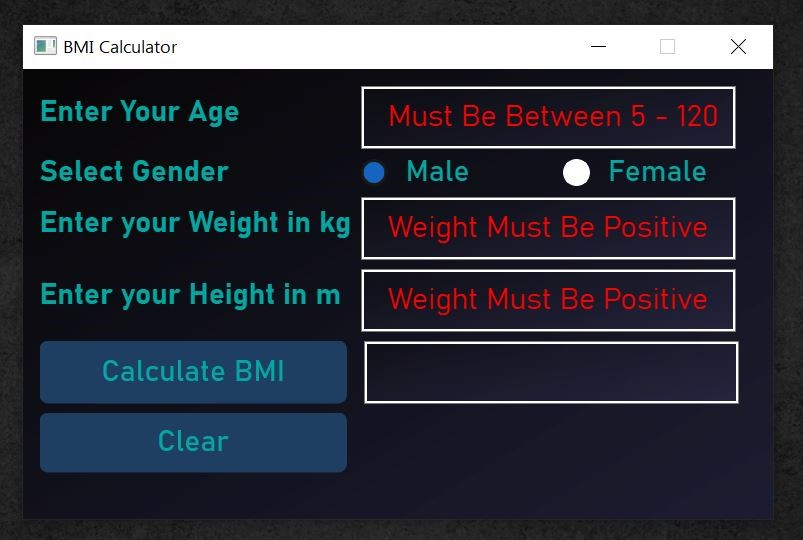
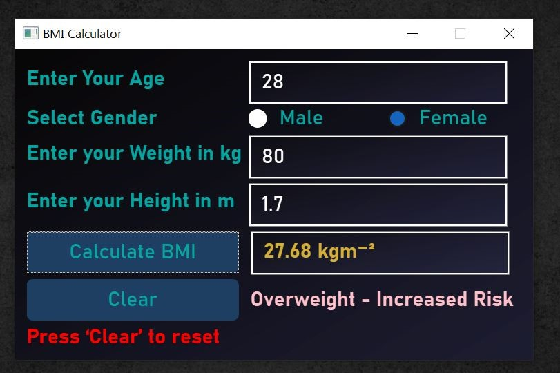

# BMI Calculator
A simple and interactive **Body Mass Index (BMI) Calculator** built with **Python** and **PyQt6**.  This application allows users to input their details and instantly calculate their BMI,  providing a user-friendly interface with clear results.

## Features
- **User Input Fields**  
  - Age (with validation: must be between 5–120 years)  
  - Gender selection (Male/Female)  
  - Weight in kilograms (positive values only)  
  - Height in meters (positive values only)  

- **Input Validation**  
  - Placeholders guide the user with “Must be a number.”  
  - Prevents entry of characters, negative numbers, or out-of-range values.  
  - Displays clear error messages such as:  
    - *“Invalid Age / Invalid Weight / Invalid Height”*  
    - *“Select your gender”* if not chosen  
    - *“Age must be in the range 5–120”*  
    - *“Height must be positive” / “Weight must be positive”*  

- **Calculation & Results**  
  - BMI is calculated **only when all inputs are valid**.  
  - Dedicated **Calculate BMI** button.  
  - Computes BMI instantly when valid inputs are provided.  
  - Shows a BMI result along with a message describing the health status.  
  - Freezes input fields after calculation to prevent accidental changes.  

- **Clear Functionality**  
  - **Clear** button resets all inputs and allows a new calculation.  
  - Removes messages and unfreezes fields.  

- **Error Handling**  
  - Application does not crash on invalid input.  
  - Provides meaningful feedback instead of breaking execution.  

## Tech Stack
- **Programming Language:** Python  
- **GUI Framework:** PyQt6  
  - `QApplication`, `QWidget`, `QFormLayout`, `QPushButton`,  
    `QLineEdit`, `QHBoxLayout`, `QRadioButton`, `QLabel`  
- **File & OS Handling:** Python `os` module (used for loading external QSS style file regardless of file location)  
- **Code Structure:**  
  - **UI Module** → Handles user interface components (`ui.py`)  
  - **Logic Module** → Contains application logic (BMI calculation, input validation, clearing inputs)  
- **Version Control:** Git & GitHub  
- **Editor/IDE:** Visual Studio Code  

## Installation
1. Download or clone this repository.  
2. Open the project folder in **Visual Studio Code** (or any Python IDE).  
3. Make sure **Python** and **PyQt6** are installed on your system.  
   ```bash
   pip install PyQt6

## Usage
1. Run the program in VS Code or from the terminal:
    ```bash
    python main.py


2. Enter the required details:

 - Age (must be between 5–120)
 - Gender (select Male or Female)
 - Weight in kilograms (positive numbers only)
 - Height in meters (positive numbers only)

3. Click Calculate BMI:

- If all inputs are valid → BMI value is displayed along with a health status message.
- If inputs are missing or invalid → error messages will appear.

4. After calculation:

- Input fields are frozen to prevent changes.
- To start again, click Clear to reset all fields.

## Screenshots
  #### Main window
   

  #### Invalid Input (Characters Entered)
   

  ####  Invalid Input (Error After Calculation)
  

  ####  Negative Value (Negative Numbers Entered)
  

  ####  Negative Value (Error After Calculation)
  

  ####  BMI Result (Valid Inputs)
  


## Project Structure
    bmi-calculator/
    │
    ├── main.py         # Main entry point of the application
    ├── ui.py           # Handles user interface components
    ├── logic.py        # Contains BMI calculation and input validation logic
    ├── style.qss       # Stylesheet for custom UI styling
    ├── README.md       # Project documentation
    ├── .gitignore      # Tells Git which files/folders to ignore (e.g., __pycache__)
    ├── LICENSE         # License file (MIT)
    └── assets/         # Folder for screenshots of the app
        ├── main_window.jpg
        ├── invalid_input_entered.jpg
        ├── invalid_input_error.jpg
        ├── negative_value_entered.jpg
        ├── negative_value_error.jpg
        └── bmi_result.jpg

## License
This project is licensed under the MIT License.  
You are free to use, modify, and distribute this software with attribution.  
See the [LICENSE](LICENSE) file for more information.

## Contributing
**Contributions are welcome!**  
If you’d like to improve this project, feel free to fork the repository and submit a pull request.

## Author
- **Manodhya Ravikumudu Senadhipathi**  
  [GitHub Profile](https://github.com/telekode)


